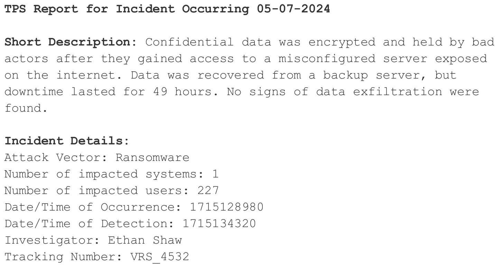

I recently participated in the DOE's [Cyberforce Conquer the Hill Competition](https://cyberforce.energy.gov/conquer-the-hill/), a jeopardy style CTF, placing 2nd out of 77 players. This was my first time participating in one of the individual Cyberforce games, but I've played in the larger event a handful of times and thoroughly enjoyed it.

I've detailed most of the challenges I was able to get through, because this competition was only 4 hours long I didn't have as much time as I'd have liked to hit the reverse engineering and harder challenges.


## gURLs Just Want to Have Fun

This challenge provided a large SQL Database representing a user's browser history with a handful of tables, we're tasked with investigating it. I was able to solve all of these questions by poking around with DB Browser for SQLite.


Part One:

`One of your coworkers just got phished and downloaded a rather suspicious file and you’ve got the browser history file available. You need to look for the answers to some questions as they’re out on vacation for the next week.`

`Look for a potentially malicious file they likely downloaded. Provide the tab URL from where the file was downloaded from.`


I started by investigating the downloads folder and found six entries:


`smartmeter_management_interface.exe` was downloaded from a google drive link (sus), which was the flag `https://drive.usercontent.google.com/download?id=1BfPZslNaHvz3olaV8_3I6ppA_IbdlHLr&export=download`.

Part Two:

`While you’re looking at downloads, it looks like there was an image of a quote downloaded. What is that quote?`


Looks like we want the contents of `simonedebeauvoir1-2x.jpg`, the downloaded url just links to [BrainyQuote](https://www.brainyquote.com/quote_of_the_day)'s quote of the day for May 2nd. I searched on the site for Simone De Beauvoir, and downloaded the latest quote with an image, "Change your life today. Don't gamble on the future, act now, without delay."


Part Three:

`They were trying to book flights. What US state is the airport they are flying out of located in?`


Now we need to switch to look at the urls table to see where the user was browsing. I found the following link: `https://www.southwest.com/air/booking/select-depart.html?int=HOMEQBOMAIR&adultPassengersCount=1&departureDate=2024-05-18&destinationAirportCode=MDW&fareType=USD&originationAirportCode=MHT&passengerType=ADULT&promoCode=&returnDate=2024-05-31&tripType=roundtrip&from=MHT&to=MDW&adultsCount=1&departureTimeOfDay=ALL_DAY&reset=true&returnTimeOfDay=ALL_DAY`, which indicated that they were looking at the MHT Airport out of **New Hampshire**.

Part Four:

`In relation to travel, they were looking up weather reports for multiple areas. Provide the name of the town that they visited a URL for outside of google.com or bing.com.`


Still in the urls table, this visited link indicates that they were looking up the weather in **Shelburne**: `https://weather.com/weather/tenday/l/Shelburne+VT?canonicalCityId=4f34aa1d907e86d210ffae254df28b73fcad23268a5874dd5f07367554a21625`.

Part Five:

`One of the GitHub repositories they were looking at recently had a massive issue in early April. What is the corresponding CVE for that vulnerability?`


In the same table, I found the following GitHub Repos:

* <https://github.com/fastfetch-cli/fastfetch>
* <https://github.com/coollabsio/coolify>
* <https://github.com/dylanaraps/neofetch>
* <https://github.com/tukaani-project/xz>

The recent xzutils backdoor had **CVE-2024-3094**.

Part Six:

`What was the visit duration value associated with the URL that has the corresponding title eCFR :: 10 CFR Chapter III – Department of Energy"?`


First I investigated the urls table and found that url id 342 linked to <https://www.ecfr.gov/current/title-10/chapter-III>. I was then able to correlate this with the visits table which had the `visit_duration` value we were looking for, id 342 had a duration of `35810787`.

Part Seven:

`At one point they downloaded a picture of a famous painting. However, they browsed pages for at least 2 famous paintings. What was the last name of artist that painted the picture which was NOT downloaded?`


In downloads we saw `The Artist's Garden at Vétheuil`, by Claude Monet. The only other painting the user browsed to (from the urls table), is `Ground Swell` by Edward **Hopper**.

## While My WAF Gently Weeps

This challenge presented us with a long excerpt of WAF logs generally in the following format: `2024-05-01 14:49:52 - 198.51.100.77 ==> PROXY-XYZ [FW-ACCEPT] [RULE-101] - - [2024-05-01 14:49:52 +0000] "POST /api/customer/referrals HTTP/2" 500 4597 "MeterLink Connect" "User-Agent: PowerSurfer/13.0"`.

To make it much faster to parse through the logs, I used grep to only look at logs that triggered a snort rule for most of the questions w/ `cat logs.txt | grep SNORT-ALERT`. This took us from 1,000 log entries to look at down to 24.

Part One:

`A recent system misconfiguration caused a bunch of issues and even put the protection systems into monitor-only mode, so malicious web-based traffic was not being blocked to company applications. Additionally, there were even some issues with rule tunings`

`Identify all IP addresses making malicious requests, comma spaced based on their order of appearance.`


This one was pretty straightforward, I took my list of snort-triggered logs and took a list of the IPs in the order they appeared: `203.0.113.157, 198.51.100.152, 203.0.113.135, 203.0.113.146, 198.51.100.141, 192.0.2.143, 192.0.2.154`.

Part Two:

`What is the User Agent associated with a successful attempt (returned a 200) to enable a feature that could be used to exploit the “MeterWise Analytics” application?`


From my filtered list of logs I started looking for anything interacting with the MeterWise Analytics application, with a response code of 200. I found the following log:

`2024-05-01 20:52:58 - 192.0.2.143 ==> PROXY-XYZ [FW-ACCEPT] [RULE-119] - - [2024-05-01 20:52:58 +0000] "GET /smartmeter/WATT/debug/mode=on HTTP/2" 200 1143 "MeterWise Analytics" "User-Agent: ThreatSeeker/2.1" SNORT-ALERT: [SID:1000156; RULE: Debug Mode Activation in SmartMeter WATT]`

Here we see someone enabling debug mode, and their user agent is **ThreatSeeker/2.1**.

Part Three:

`What was the full timestamp associated with the last SQL injection attempt?`

Back to our filtered list, the last entry I saw attempting SQL Injection was: `2024-05-01 20:26:14 - 192.0.2.154 ==> PROXY-XYZ [FW-ACCEPT] [RULE-108] - - [2024-05-01 20:26:14 +0000] "POST /smartmeter/WATT/login?username=&password= OR 1=1 -- HTTP/2" 404 4452 "MeterLink Connect" "User-Agent: MidnightAsterProbe/3.1" SNORT-ALERT: [SID:1000162; RULE: SQL Injection Attempt on SmartMeter WATT Login]`

It's timestamp was **2024-05-01 20:26:14**.

Part Four:

`Identify the IP address that attempted to access sensitive system files through path traversal that did not have a snort rule triggered.`


Sadly the snort list fails us here, tragic stuff. This time I searched for `/..` in a text editor to find attempted directory traversal. I found these two attempts:

```text
2024-05-01 22:36:48 - 192.0.2.143 ==> PROXY-XYZ [FW-ACCEPT] [RULE-114] - - [2024-05-01 22:36:48 +0000] "GET /smartmeter/WATT/setup?mode=test&config=../../../root/.ssh HTTP/2" 403 915 "MeterWise Analytics" "User-Agent: ThreatSeeker/2.1" SNORT-ALERT: [SID:1000164; RULE: Misconfigured Setup Mode in SmartMeter WATT]

2024-05-01 20:07:06 - 203.0.113.157 ==> PROXY-XYZ [FW-ACCEPT] [RULE-107] - - [2024-05-01 20:07:06 +0000] "GET /employee/api/logs?file=../../../etc/shadow HTTP/2" 404 2033 "SmartGrid Portal" "User-Agent: MidnightAsterProbe/3.1"
```

The first attempt *did* trigger a snort rule, so the second IP of **203.0.113.157** is our flag.

## This is Actual Malware

Prompt:

```text
!!!THIS IS EXTREMELY IMPORTANT!! COMPETITORS: DO NOT DUMP THE PROCESS. THIS IS MALWARE!!!

Memory Forensics is a field of study that takes a volatile snapshot of a system (typically RAM) and tries to peace together what has occurred. In this instance, a snapshot titled ‘CyberForce-VM-Infected-5’ was taken of an infected system. Hidden inside is a malware process

Use Volatility on the system to identify the malware process and its’ PID. You can run volatility by running vol.py in the Volatility3 folder.
```

Sounds like we should dump the process. I booted up the VM and started to investigate the provided image.

First I ran the `windows.info.Info` plugin, which didn't really wow me with anything useful. I then ran `windows.psscan.PsScan` to find any running/hidden processes.


The only process which really jumped out to me was `enbry.exe` which had a PID of `7592`. This isn't a standard windows process, and I wasn't able to find any information about it online, surprise surprise this was our malware.

## Sloggin Through These Logins

Prompt:

`Our organization's security team has discovered suspicious anomalies in the system logs of a critical network infrastructure. These anomalies suggest potential tampering or manipulation, posing a significant threat to the integrity and security of the network. As a cybersecurity analyst, your task is to investigate the provided system logs, identify evidence of tampering or manipulation, and determine the extent of the threat to the network's security. Your objective is to provide a clear and definitive answer regarding the presence of log tampering and recommend actionable steps to mitigate the risks. `

Challenge Objectives:

1. Analyze the provided system logs to identify any indications of tampering or manipulation.
2. If applicable, determine the culprit’s name and enter that into the scoreboard for full points. If no compromise is found, simply type in “null” into the scoreboard for full points.


We're given 40 logs entries, I found the following ones to be notable:

```text
Log 7:
Timestamp: 2023-07-20 08:45:00
Event: User authentication success
User: david
Description: Successful login from IP address 192.168.1.25.

Log 10:
Timestamp: 2023-07-20 09:30:00
Event: User authentication success
User: james
Description: Successful login from IP address 192.168.1.25.

Log 11:
Timestamp: 2023-07-20 09:45:00
Event: User authentication failure
User: james
Description: Failed login attempt from IP address 192.168.1.25 using incorrect credentials.

Log 20:
Timestamp: 2023-07-20 11:00:00
Event: User authentication success
User: james
Description: Successful login from IP address 192.168.1.25.

Log 21:
Timestamp: 2023-07-20 11:15:00
Event: User authentication failure
User: james
Description: Failed login attempt from IP address 192.168.1.25 using incorrect credentials.

Log 30:
Timestamp: 2023-07-20 12:30:00
Event: User authentication success
User: james
Description: Successful login from IP address 192.168.1.25.

Log 31:
Timestamp: 2023-07-20 14:00:00
Event: User authentication success
User: james
Description: Successful login from IP address 192.168.1.25.

Log 32:
Timestamp: 2023-07-20 14:15:00
Event: User authentication success
User: james
Description: Successful login from IP address 192.168.1.25 using elevated privileges.
```

We see a two users logging in from the same address, a handful of authentication failures, and then a successful login using elevated privileges all for the James user. **James** was in fact our culprit.

## HonestUser

An innocent user had their data stolen. Answer the following questions by analyzing the attached pcap.

Part One:

`What port was exploited?`

Investigating the PCAP I saw some FTP traffic that appeared to be unencrypted, including a user's login.


Port **21** was the flag.

Part Two:

`What protocol was used to gain initial entry?`

As previously discovered, **FTP**.

Part Three:

`What was the phrase the exploiter found?`

I found a TCP stream with what appears to be the attacker's shell gained after exploiting FTP.


Here we can see them cat `flag.txt` with the flag `f0undm3`

## TPS Report

We're provided with 3 documents to evaluate an incident report from Vivara Research Solutions according to the [NCISS System](https://www.cisa.gov/news-events/news/cisa-national-cyber-incident-scoring-system-nciss) provided by CISA.



Part One:

`Which NCISS functional impact category best fits the incident described in Vivara_TPS.zip?`

The functional impact categories are described as follows:

1) No Impact
2) No Impact to Services
3) Minimal Impact to Non-Critical Services
4) Minimal Impact to Critical Services
5) Significant Impact to Non-Critical Services
6) Denial of Non-Critical Services
7) Significant Impact to Critical Services
8) Denial of Critical Services /Loss of Control


According to the incident report, this would best align with option 6, **Denial of Non-Critical Services**, the server experienced 49 hours of downtime although it didn't maintain any business critical function.

Part Two:

`Which NCISS informational impact category best fits the incident described in Vivara_TPS.zip?`

The impact categories are described as follows:

1) No Impact
2) Suspected but Not Identified
3) Privacy Data Breach
4) Proprietary Information Breach
5) Destruction of Non-Critical System
6) Critical Systems Data Breach
7) Core Credential Compromise
8) Destruction of Critical System

Option 5, **Destruction of Non-Critical System**, seems to fit this incident the best. The attacker deployed ransomware which rendered the non-critical system unusable.

Part Three:

`Which NCISS attribute for location of observed activity best fits the incident described in Vivara_TPS.zip?`

The location of observed activity attributes are described as follows:

1) Level 1 - Business Demilitarized Zone
2) Level 2 - Business Network
3) Level 3 - Business Network Management
4) Level 4 - Critical System Demilitarized Zone
5) Level 5 - Critical System Management
6) Level 6 - Critical Systems
7) Level 7 - Safety Systems
8) Unknown

This incident occurred on the **Business  Network**, the server was a confidential internal resource which didn't interact with critical systems.

Part Four:

`Which part of the CIA triad was most impacted by the incident described in Vivara_TPS.zip?`

**Availability**, ransomware was deployed, suprise surprise.

Part Five:

`In minutes, how much time passed between occurrence and detection during the incident described in Vivara_TPS.zip?`

The report states that the incident occured at `1715128980`, and was detected at `1715134320`, so **89 minutes** elapsed.

## Hidden Code

We're presented with a word document about the moon, notably there's letters highlighted red, and a lot of gaps in the text.


Part One:

`Decode the secret Message, the secret message is all the red letters in the text.`

Never would've guessed. Taking all the red characters gives us `I3Z0h3Q0pwbt`.

Part Two:

`The secret word to decrypt the message`

I shot from the hip here and correctly guessed **moon**, it was either that or lunar.

Part Three:

`Highlight all the text to find the hidden code within the article. Copy this into a python compiler and enter the message and secret word. The output will be the flag`

I highlighted the hidden text, cleaned it up, and inputted the pieces of info we already had to get the following python code to run:

```python
def decrypt(encrypted_message, secret_key):
    decrypted_message = []
    key_length = len(secret_key)

    for i, char in enumerate(encrypted_message):
        key_char = secret_key[i % key_length]
        shift = ord(key_char) - ord('A')
        if 'A' <= char <= 'Z':
            decrypted_char = chr((ord(char) - ord('A') - shift) % 26 + ord('A'))
        elif 'a' <= char <= 'z':
            decrypted_char = chr((ord(char) - ord('a') - shift) % 26 + ord('a'))
        else:
            decrypted_char = char
        decrypted_message.append(decrypted_char)
    return ''.join(decrypted_message)

encrypted_message = "I3Z0h3Q0pwbt"
secret_key = "MOON"
decrypted_message = decrypt(encrypted_message, secret_key)

print("Decrypted message:", decrypted_message)
```

Running this gets us the flag `W3L0v3C0ding!`

## CryptK33per

Prompt: 

`Solve the cryptopuzzle for full points`

We're initially presented with a fun PDF, and a second PDF which is password protected.


The two areas of note are the glypss on the monitor, and encoded text on the table.


I wasn't familiar with this alphabet, but I hunted around online and eventually found a key on [deciphersxyz](https://deciphersxyz.wordpress.com/ciphers/):


The text decodes to: `Decode the cipher to access the next puzzle`. Huge time waster with how long it took me to find the key 😭.


This was encoded with base32, and decodes to `Astraeus`, which was the key to the second PDF.


If you look closely at the rays of the sun, there's morse code to transcribe, yippee!


This took me a while, but I got the following phrase which was the flag:

`YET KNOWING HOW WAY LEADS ON TO WAY, I DOUBTED IF I SHOULD EVER COME BACK. I TOOK THE ONE LESS TRAVELED BY, AND THAT HAS MADE ALL THE DIFFERENCE`

This is an excerpt from *The Road Not Taken*, by Robert Frost.

## Trivia

### General Trivia

1. Which of the following is a technique used in post-exploitation to maintain persistent access to a compromised system without relying on traditional backdoors or implants?

* Kernel patching
* Rootkit installation
* **Scheduled task creation**
* DLL hijacking

2. What is the primary purpose of a bind shell payload in a penetration testing scenario?

* To establish a reverse connection from the attacker's machine to the target system.
* To execute arbitrary commands on the target system and return the results to the attacker.
* **To open a network port on the target system and listen for incoming connections from the attacker.**
* To encrypt communication between the attacker and the target system to evade detection.

3. Explain the difference between symmetric and asymmetric encryption

* Symmetric encryption uses two different keys for encryption and decryption, while asymmetric encryption uses the same key for both processes.
 - Symmetric encryption is faster than asymmetric encryption, while asymmetric encryption offers better security.
 - Symmetric encryption uses a pair of keys: a public key for encryption and a private key for decryption, while asymmetric encryption uses only one key for both processes.
 - **Symmetric encryption uses a single key for both encryption and decryption, while asymmetric encryption uses a pair of keys: a public key for encryption and a private key for decryption.**
 
4. Which of the following is a technique often utilized by attackers to evade detection by security tools and defenders, involving the encryption of malicious payloads to bypass signature-based detection mechanisms?

 - Cross-site scripting (XSS)
 - DNS tunneling
 - Data exfiltration
 - **Payload obfuscation**
 
5. In a penetration testing scenario, which of the following methods is commonly used to escalate privileges on a compromised system when traditional methods fail?

 - Reverse engineering
 - Fuzzing
 - **Kernel exploitation**
 - DLL injection
 
6. Which of the following is a technique used in a buffer overflow attack to redirect the program's execution flow to malicious code injected by the attacker?

 - Code obfuscation
 - Integer overflow
 - **Return-oriented programming (ROP)**
 - Cross-site scripting (XSS)
 
7. During a penetration test, the tester discovers an outdated FTP server running on the target network. Which of the following techniques would be MOST effective for exploiting this vulnerability?

 - **Directory traversal attack**
 - Cross-site scripting (XSS)
 - SQL injection
 - Buffer overflow exploit
 
8. In a penetration testing scenario, what is the primary purpose of using a reverse shell payload?

 - **To establish a connection from the attacker's machine to the victim's machine.**
 - To encrypt data transmitted between the attacker and the victim.
 - To exploit a vulnerability in a web application.
 - To perform a denial-of-service (DoS) attack on the target network.
 
9. In a penetration testing scenario, what is the primary objective of post-exploitation activities after gaining initial access to a target system?

 - Deleting system logs to cover tracks
 - Extracting sensitive data from the compromised system
 - **Installing backdoors for persistent access**
 - Patching vulnerabilities to secure the system
 
10. In a penetration test, which of the following techniques would be most effective for escalating privileges after gaining initial access to a target system?

 - Conducting a brute-force attack against system services.
 - Exploiting misconfigured network shares to gain access to sensitive files.
 - Leveraging a zero-day vulnerability to execute arbitrary code.
 - **Exploiting a known vulnerability to escalate privileges via a privilege escalation exploit.**

11. Which of the following is a key component of a firewall?

 - Intrusion Detection System (IDS)
 - Anti-virus software
 - Router
 - **Access Control List (ACL)**

12. What is the main advantage of using asymmetric encryption over symmetric encryption?

 - Faster encryption and decryption speed
 - Requires only one key for both encryption and decryption
 - **Provides better security for key distribution**
 - Less complex implementation
 
13. What type of attack attempts to deceive users into visiting malicious websites by redirecting them from legitimate websites?

 - Man-in-the-Middle (MitM)
 - Cross-Site Scripting (XSS)
 - **Phishing**
 - SQL Injection
 
14. What is the purpose of a VPN (Virtual Private Network)?

 - To hide IP addresses
 - **To secure network traffic over public networks**
 - To encrypt files on a local computer
 - To prevent malware infections
 
15. Which of the following is NOT a common authentication factor?

 - Password
 - Biometrics
 - Security Token
 - **Public Key**

### Energy Trivia

1. The Department of Energy supports advancements in sustainable transportation. Which of the following is NOT a focus area?

 - Electric vehicle (EV) infrastructure
 - Biofuel production
 - Hydrogen fuel cells
 - **Lead-acid battery research for EVs**
 
2. Which U.S. agency launched the "Building a Better Grid initiative to expand and modernize the nation's electric grid?

 - Environmental Protection Agency (EPA)
 - **Department of Energy (DOE)**
 - Federal Energy Regulatory Commission (FERC)
 - Department of Defense (DOD)
 
3. Which innovative technology was the Department of Energy exploring to enhance grid resilience against cyber-attacks in 2023 according to their GMI calls?

 - Blockchain technology
 - **Quantum encryption communications**
 - AI threat detection systems
 - Satellite grid monitoring
 
4. What should be the primary objective of a risk management strategy?

 - Determine the organization's risk appetite.
 - Identify credible risks and transfer them to an external party.
 - **Identify credible risks and reduce them to an acceptable level.**
 - Eliminate credible risks.
 
5. Based on the 2023 U.S. Energy Information Administration, this was the leading renewable energy source.

 - Solar
 - Hydropower
 - **Wind**
 - Geothermal
