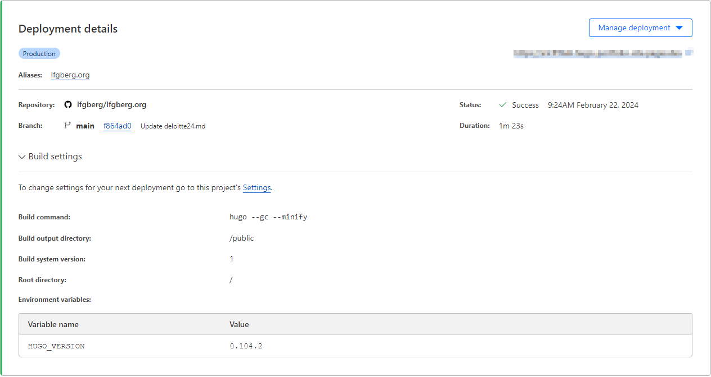

This post will serve as a brief overview of why I chose to create a portfolio site, and how to create your own with zero hardware and a relatively low barrier to entry. I created my site using [Hugo](https://gohugo.io/), and the [Blowfish Theme](https://blowfish.page/). I'll be providing any resources I utilized, but will not be providing step-by-step instructions on configuration. My end goal with this project was to have a centralized platform to stand out when applying to jobs and internships by showcasing my projects and interests as well as coursework. As a student, this is an extremely helpful tool to show initiative and commitment to the field outside of the classroom, and I've found it to be an engaging low-stress project to work on.

Here's my project repo for an example to follow along with:



## Before we start

### Goals

When choosing my tech stack for this portfolio I kept the above goals in mind:

1. No hardware required
2. Low to no cost
3. Simple formatting

### What and Why?

- Hugo
  - Hugo is a flexible framework for building websites
  - Utilizes markdown syntax, no web design skills needed
  - Easy to maintain
  - Has robust options for themes and shortcodes
  - Supported by GitHub and Cloudflare Pages
- Cloudflare Pages
  - Free environment to host and deploy a site
  - Syncs to a GitHub repo and auto-deploys
  - Works well with my domain already being managed by Cloudflare

## Creating a Hugo Site

### Setting up a Development Environment

Before we can start creating content, we need to set up Hugo and a Git repository to work in. Create a new GitHub repository and clone it locally to start working. Later once we've configured Cloudflare pages, content from the GitHub repo will be automatically deployed to your site.

[Install Hugo](https://gohugo.io/installation/) on your local machine, and initialize a new project within your repo with `hugo new site [your site name]`. Hugo will automatically generate the file structure of a Hugo site, move everything into the root of your repo and delete the folder Hugo generated.

Next, add a theme, this will do a lot of the leg work of creating the site for you. I chose to use the [Blowfish Theme](https://blowfish.page/docs/installation/), you can add this to your project by adding it as a git submodule in the themes folder with `git submodule add -b main https://github.com/nunocoracao/blowfish.git themes/blowfish`. Checkout [this page](https://themes.gohugo.io/) for more Hugo theme options.

Your chosen theme should have documentation on how to configure it, I'll be operating on the assumption that you're using blowfish. To get blowfish up and running, you'll need to copy the example `themes/blowfish/config` to your repos `config/_default` folder. For full details on configuring blowfish [read the docs](https://blowfish.page/docs/configuration/#site-configuration).

Once completing the initial configuration, you should be able to run `hugo server` to spin up a local preview of your site.

### Creating Content

Hugo offers commands to create new posts, pages, etc. with `hugo new content [dir]/[name].md` that I frankly do not find to be necessary. The theme you use will dictate the specifics of how you organize your site and create content. I tend to manually create new markdown files and edit my site using VSCode with the Hugo, Grammarly, and markdownlint plugins. For info on creating content specifically with blowfish, [read the docs](https://blowfish.page/docs/content-examples/).

As you edit your site and push new content, use `hugo server` to view your changes locally before pushing to GitHub. Next, we'll setup Cloudflare pages to automatically deploy the site from our GitHub repo.

## Configuring Cloudflare

The only part of this project with any cost attached is purchasing a domain, I chose to purchase my domain from Cloudflare because I wanted the additional flexibility it could provide to build out things like custom email, etc. This project could easily be made free by omitting this step and using GitHub pages to create the entire thing for free. Feel free to read more about it [here](https://pages.github.com/).

### Cloudflare Pages

Cloudflare Pages provides an easy and flexible way to deploy a Hugo site to the internet. From the Cloudflare dashboard, navigate to `Workers & Pages`, and create an application. Select `Pages`, and `Connect to Git`:

### Production Deployment

Connect your GitHub account, and select the repo you created with your Hugo site in it. Select the main branch, and Hugo as your framework. Set the build command to `hugo --gc --minify` and add a new environment variable `HUGO_VERSION` with a value of `0.104.2`. The final deployment should look something like this:

Next, navigate to `Custom Domains` under your page, and add your domain. This will make it so your content is served on the appropriate URL:

YIPPEE, all changes to the main branch of your GitHub repo will now be deployed to the configured domain.

### Preview Deployments

Preview deployments allow you to have secondary deployments of your CF Pages App. This allows you to configure specific branches of your GitHub repo to be deployed on a different url than your production branch ex. `[Commit Hash].[Projecct Name].pages.dev`. This is great for testing purposes, and allows you to see your changes in a real environment before pushing it to your main site.

I have mine configured so that branches fitting the pattern `(.*-dev)|(dev-.*)` so that all branches beginning or ending with the `-dev` prefix/suffix are deployed as preview branches. If you want to take an extra step, you can use Cloudflare Zero Trust to restrict access to your preview deployments so that people aren't stumbling across your works in progress.

## Workflow

1. Locally develop content
2. Test it with `hugo server` locally
3. Deploy to a `-dev` branch
4. Check the Cloudflare preview deployment
5. Restart if issues are present, deploy to main if not
