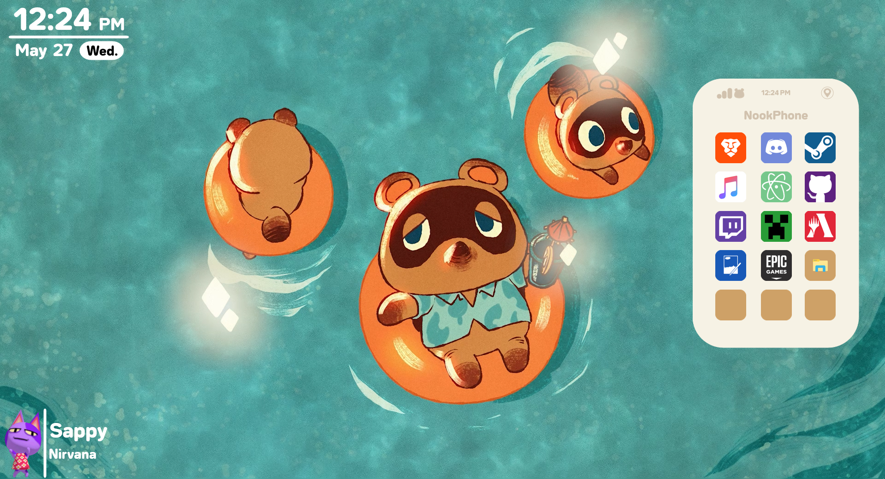

This is a skin designed for the desktop customization tool [Rainmeter](https://www.rainmeter.net/). It offers a program launching utility that can be customized with different provided icons and is modeled after a similar utility from the game. There's also a clock, and utility to display information from a music player. The launcher offers different size variants and models your WiFi Connection signal strength.


