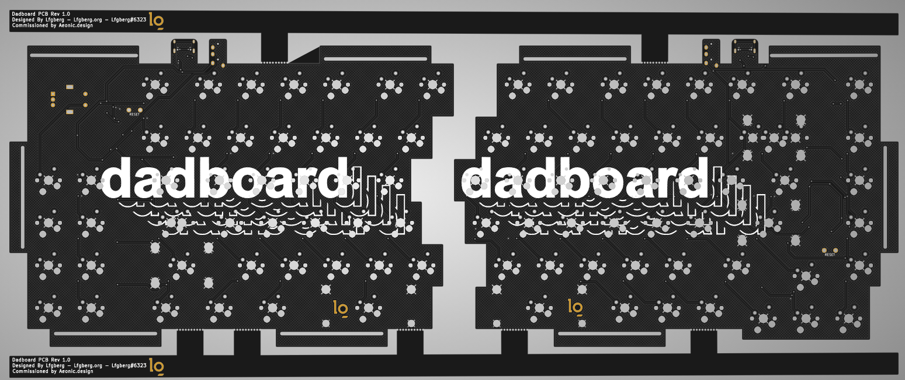


**Warning!** This PCB Hasn't been produced and tested, do so at your own risk!


This is a PCB commissioned by [aeonic-dev](https://github.com/aeonic-dev "Aeonic's GitHub"). It's designed for use with either soldered south-facing MX-style switches, or north-facing kailh hotswap sockets. The two halves can be connected with TRRS jacks, and have USB-C. The board can use either an ATMEGA 32U4 AU/MU and is designed with mouse bites to break apart and be produced in one piece.


