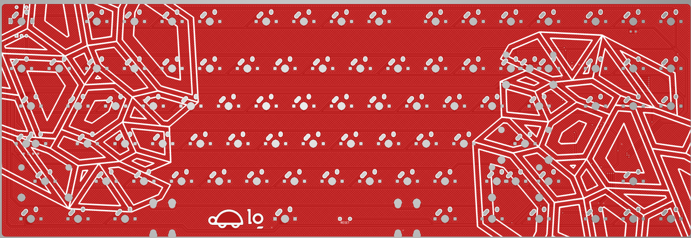
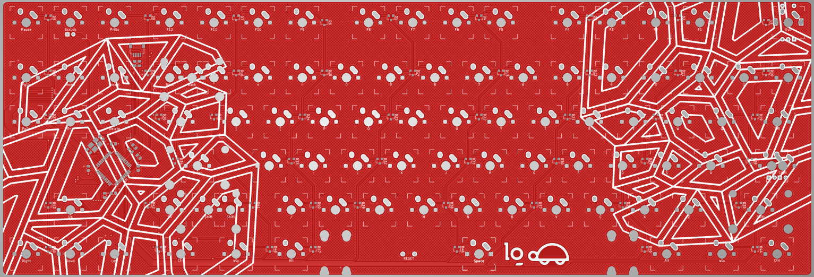
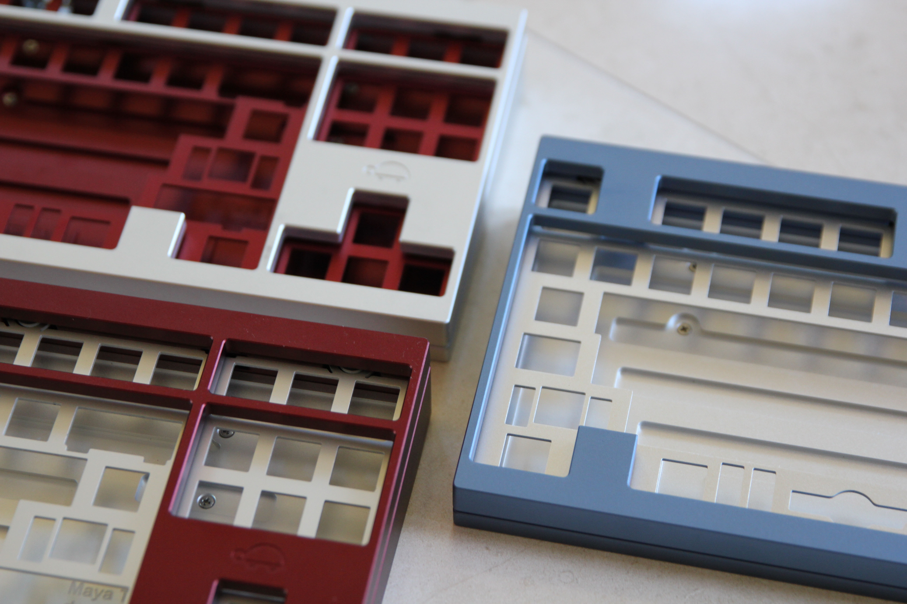

Both of these PCBs were commissioned for [DerpTurtle](https://github.com/RyanWooHoo), and are not currently open-source.
# Maya TKL

This PCB utilizes a Unified-C daughterboard for USB, features a duplex matrix, and offers support for either MX-style or Alps switches. The geekhack post with more details about the board can be found [here](https://geekhack.org/index.php?topic=114048.0).
# Maya Mini

