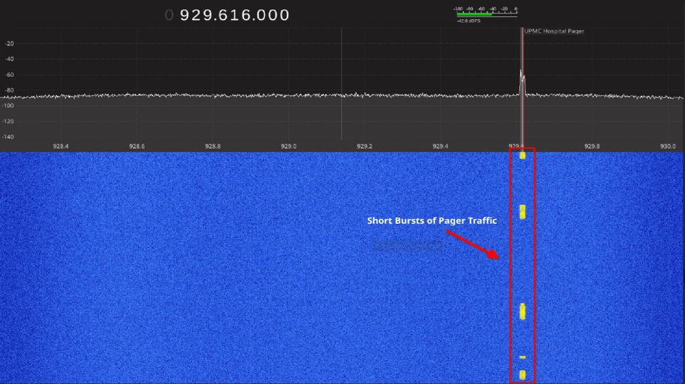
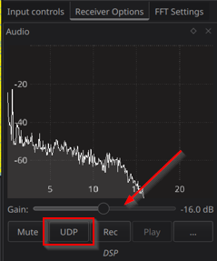

I recently held a Software Defined Radio (SDR) focused meeting for [CCSO](https://psuccso.org), playing around with an RTL-SDR. We had some fun decoding local hospital pager data, listening to radio stations, investigating car key fobs, and identifying other local signals.


This deals with sensitive PHI! All transmissions shown in this post or during the CCSO meeting were redacted to maintain confidentiality.


## Hospital Pagers

Surprisingly, many hospitals transmit pager data completely unencrypted. In the State College area, I was able to observe messages about Mt. Nittany, Allegheny Health Network, and UPMC, with messages being transmitted fairly frequently. Although a lot of the traffic seemed to be from automated systems, various messages were exchanging PHI such as patient phone numbers, names, medications, etc.

Despite being unencrypted and easy to decode, these pager systems are still fairly widely used due to their range and reliability. Pagers rarely need to be charged, have a long-range, and work when cell networks are down. Additionally, communication is one way, and the low powered devices aren't suited to complex cryptographic operations. [Sam Kim](https://www.samkim.io/#/) has an interesting project [pager-sec](https://github.com/sam-k/pager-sec) where he proposes utilizing ChaCha, a lightweight symmetric encryption protocol, to solve this issue. His project is worth a read and was very helpful when trying to decode local pagers.

## Identifying a Signal

To get started, you need to identify a frequency with local pager traffic to decode. These can vary based on your location, but the 929-932MHz range is commonly used. I found success at 929.616MHz. I utilized a cheap [RTL-SDR](https://www.rtl-sdr.com/buy-rtl-sdr-dvb-t-dongles/) for this, and [gqrx](https://www.gqrx.dk/) to identify and find pager transmissions.



Modern pagers commonly use either the FLEX or POCSAG protocols for transmission, all of the local transmissions I was able to find utilized FLEX. The [Signal Identification Wiki](https://www.sigidwiki.com/wiki/FLEX) is a super helpful resource for figuring out what you're looking at, and pagers have a fairly characteristic audio that's easy enough to pick out.

## Decoding the Signal

Once you've identified a valid POCSAG or FLEX pager transmission, we need to pipe the output into audio processing and decoding tools. In GQRX click the UDP button in the bottom right-hand corner; this will send the data from gqrx to port 7355 for use with CLI utilities.



We're going to pipe this data into sox, and multimon-ng to perform audio processing and subsequently decode the data using the following command:

```bash
ncat -lu 7355 \                              
| sox -t raw -esigned-integer -b16 -r 48000 - -esigned-integer -b16 -r 22050 -t raw - \
| multimon-ng -t raw -a FLEX -a POCSAG512 -a POCSAG1200 -a POCSAG2400 -
```

This command:

1. Takes in the data from gqrx w/ netcat
2. Uses sox to reformat the audio
3. Decodes FLEX/POCSAG w/ multimon-ng

I saved this to `pager-decode.sh` for easy access later on. It might take a while to get a transmission, but you should see decoded messages showing up in the terminal. If your antenna or reception isn't great, the messages may not decode or may have some garbled output. I fiddled with the squelch and gain in gqrx as well to improve results.

## Example (Redacted) Transmission


